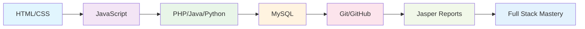

# <div align="center">👨‍💻 Software Engineer | Full Stack Developer</div>

<div align="center">
  
</div>

<div align="center">
  
</div>

##  About Me


```python
class SoftwareEngineer:
    def __init__(self):
        self.name = "PM Himasha Shehan"
        self.role = "Full Stack Developer"
        self.location = "Gampaha, Western Province, Sri Lanka 🇱🇰"
        self.education = "Java Institute Advanced Technology [BCU of UK]"
        self.languages = ["Java", "JavaScript", "Python", "PHP", "HTML", "CSS"]
        self.databases = ["MySQL", "HeidiSQL"]
        self.tools = ["Git", "GitHub", "Jasper Reports"]
        self.current_focus = "Building scalable web applications"
    
    def say_hello(self):
        print("Thanks for dropping by! Let's build something amazing together!")

me = SoftwareEngineer()
me.say_hello()
```

<br>

🔭 **Currently Working On:** Enterprise web applications with Java & PHP  
🌱 **Learning:** Java Institute Advanced Technology [BCU of UK]  
💡 **Passionate About:** Clean code, problem-solving, and innovative solutions  
🎯 **2024 Goals:** Contribute to open source, master full-stack development  
⚡ **Fun Fact:** I debug with rubber duck programming! 🦆  

##  Tech Stack & Tools

<div align="center">

###  Frontend Development


###  Backend Development


###  Databases


###  Tools & Platforms


</div>


##  GitHub Analytics

<div align="center">
  
  
</div>

<div align="center">
  
</div>

##  Contribution Graph


##  Achievement Showcase

<div align="center">
  
</div>

##  Current Learning Path

<div align="center">



</div>

##  Connect With Me

<div align="center">
  
[](mailto:himashashehan0813@gmail.com)
[](https://linkedin.com/in/himasha-shehan)
[](https://github.com/HimashaExe)
[](https://twitter.com/HimashaExe)

</div>

<div align="center">
  
</div>

##  Latest Blog Posts
<!-- BLOG-POST-LIST:START -->
<!-- BLOG-POST-LIST:END -->

##  Random Dev Quote

<div align="center">
  


</div>

---

<div align="center">
  
###  Thanks for visiting! Let's code something amazing together! 


</div>

<div align="center">
  
</div>
